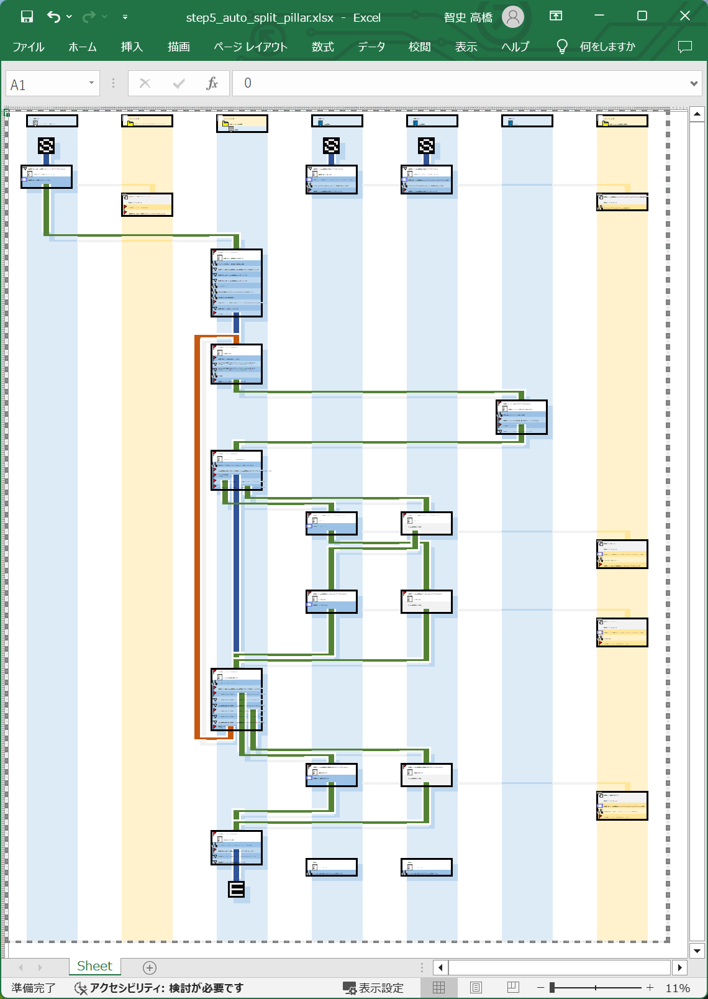
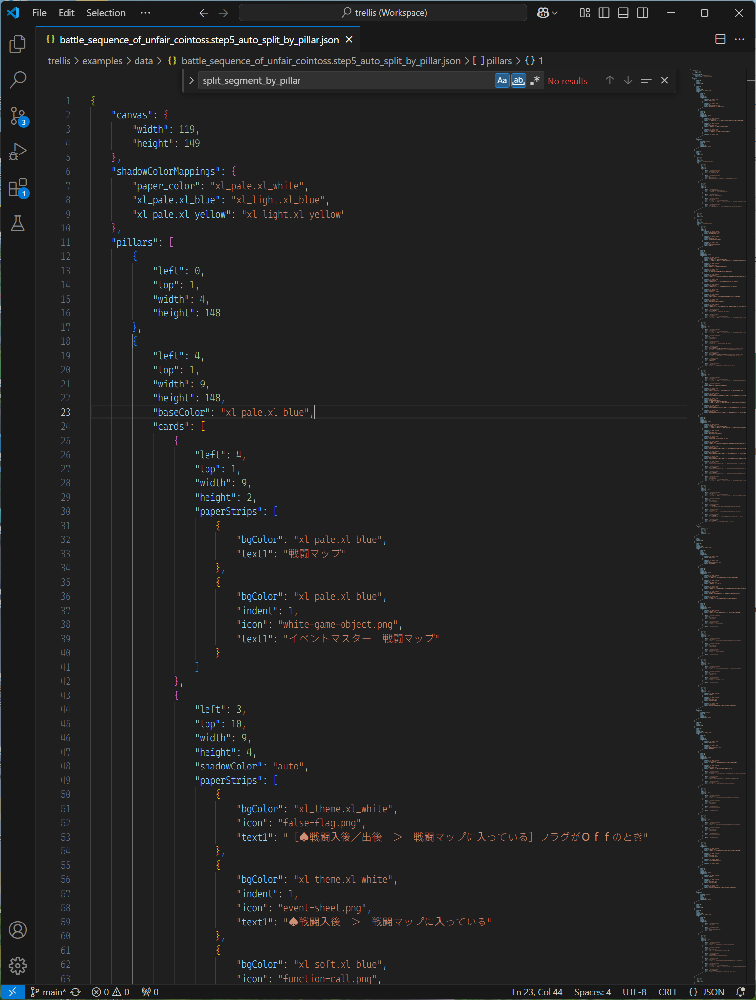

# trellis

RPGBakin の自作戦闘を設計するために勝手に作ったった設計図を出力するツール。ＧＵＩはまだ無い  

## 成果物

  

👆　上記のようなフローチャートが描かれたワークシートを出力します。  
内容を確認するには、 Microsoft Excel が必要です。  

  

👆　ソースファイルは JSON 形式です。  
仕様書はまだ書けていません。サンプルを解析してください。  

## Git Hub を見ている人向けの説明

Git Hub が何だか分からない人は、この節は読み飛ばしてください。  

* 📖 [Git Hub を見ている人向けの説明](./docs_dev/from_git_hub.md)
    * インストール方法、コマンド操作方法の説明など

## Trellis の作り方の説明

［トレリスを使う人］ではなく、［トレリスを作るプログラマー］向けの説明なので、専門的な座学みたいになっています。  

* 📖 [プログラミング・レッスン１](./docs/programming_lesson/1/README.md)
    * トレリスで使われている座標の説明など

## 更新履歴

* [x] (2025-01-12) 現状、 Terminal は start １つ、 end １つしか設定できない。複数設定できるようにしたい ---> (2025-01-12) Done
* [x] (2025-01-12) 現状、 Pillar に Id を付けているが、要らないのでは？ ---> (2025-01-12) Pillar の Id を廃止
* [x] (2025-01-12) 内部的には、柱と柱の隙間も柱として扱いたい ---> (2025-01-12) Done
* [x] (2025-01-13) Square, Rectangle オブジェクトを四則演算できるようにしたい ---> (2025-01-12) Done。cell_num, cell_th プロパティ追加
* [x] (2025-01-13) Square クラスを、 InningsPitched にリネームしたい ---> (2025-01-13) Done
* [x] (2025-01-25) Pillar の baseColor を "#FFFF00" 形式にすると例外、 "xlPale.xlBlue" 形式なら Ok という不具合がある
    * `fill_rectangle` がエラーを起こす？ ---> PatternFill を返す関数で、ウェブセーフカラー文字列を返していた
* [x] (2025-01-25) Border, Font, Rectangle, Segments の color を varColor に変更したい
* [ ] (2025-01-26) JSONを生成するコードのテンプレもJSONで用意したい。JSON構造の仕様変更時に対応しやすいように。
