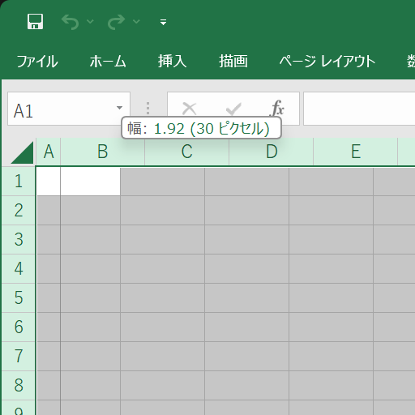
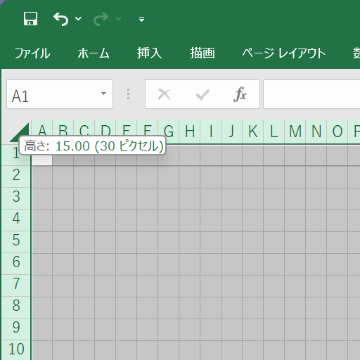
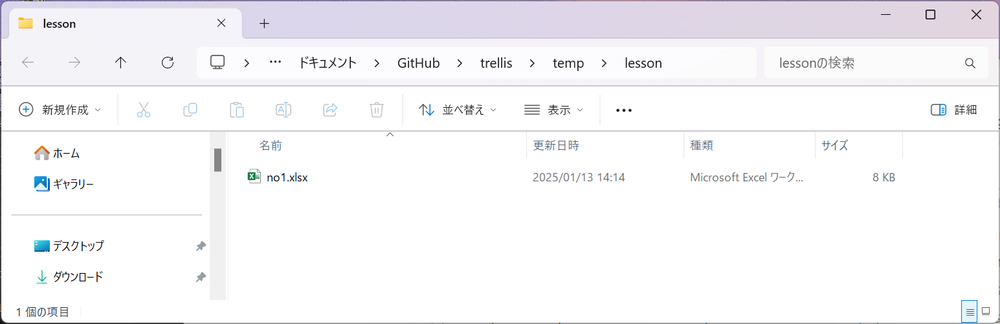
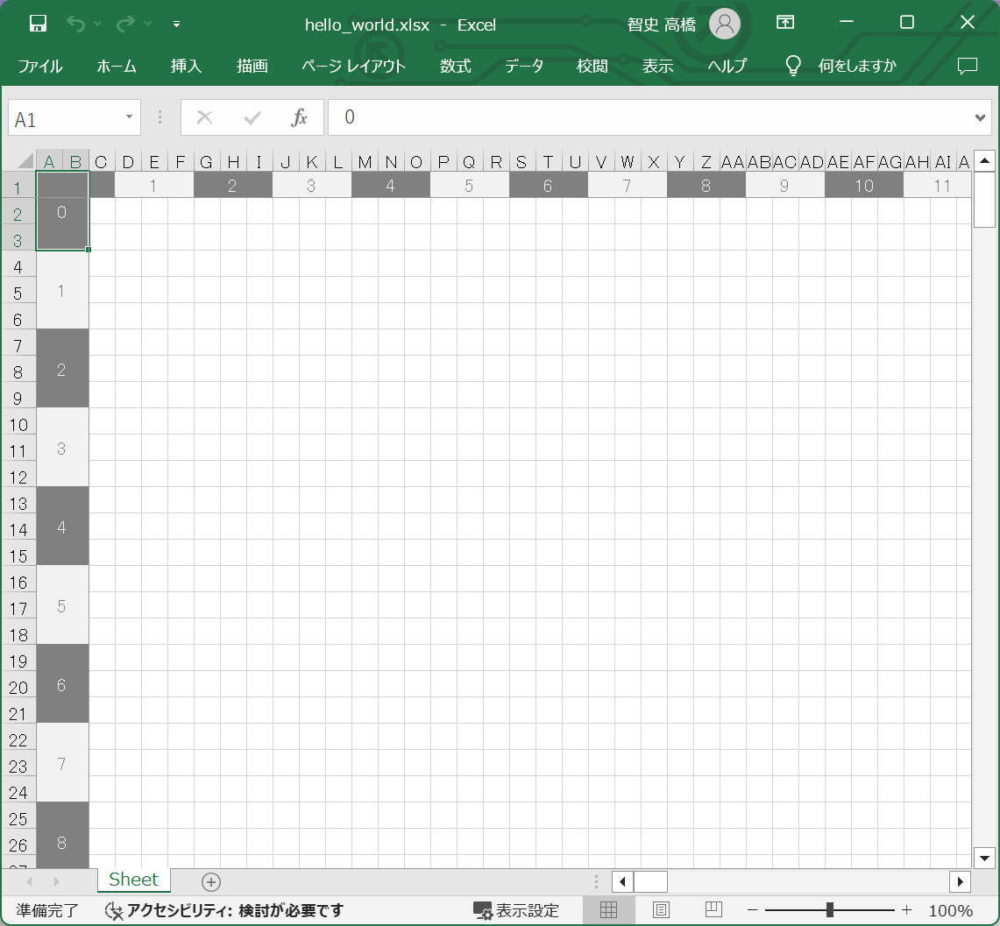
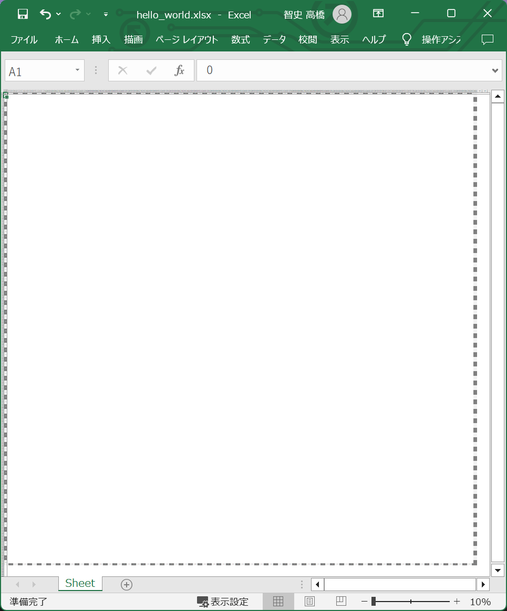
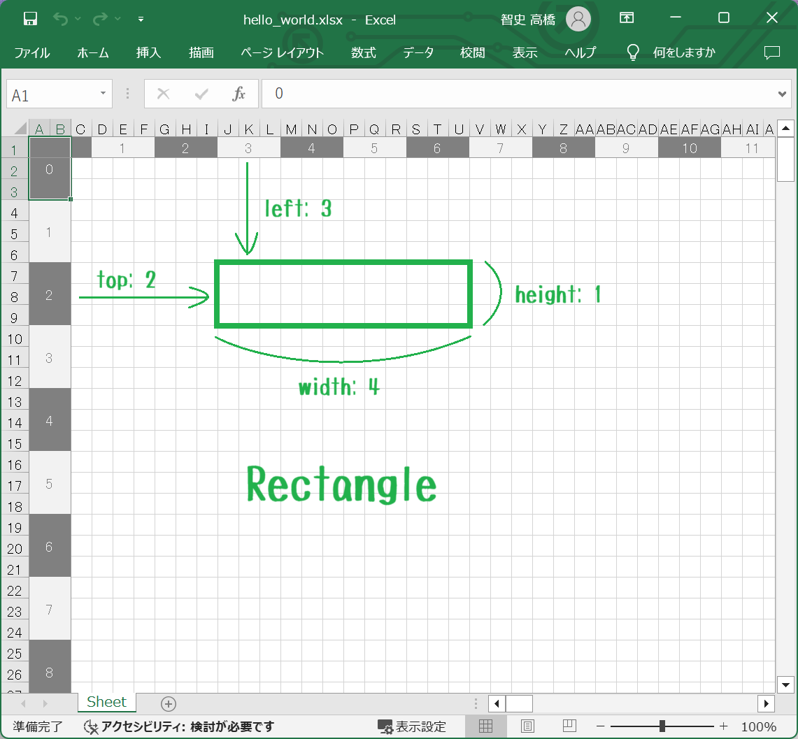
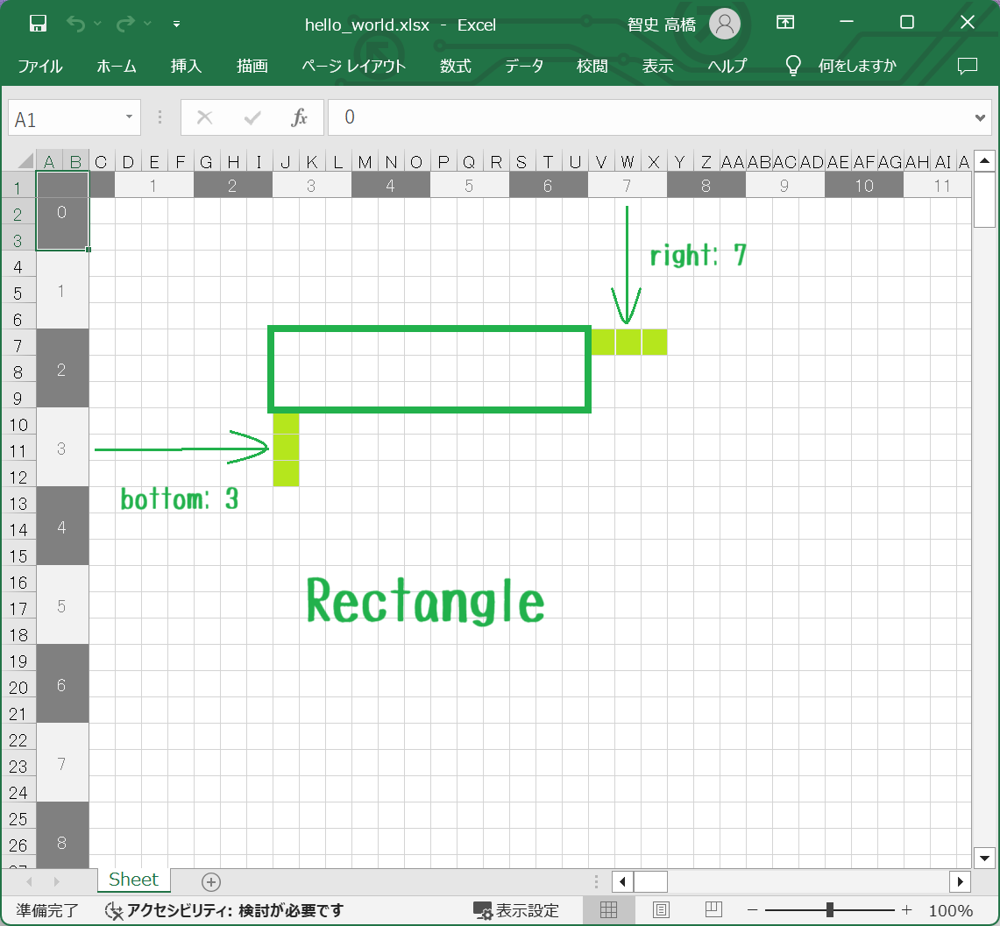
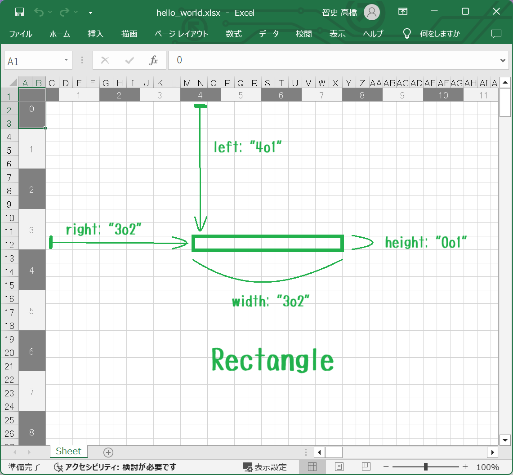
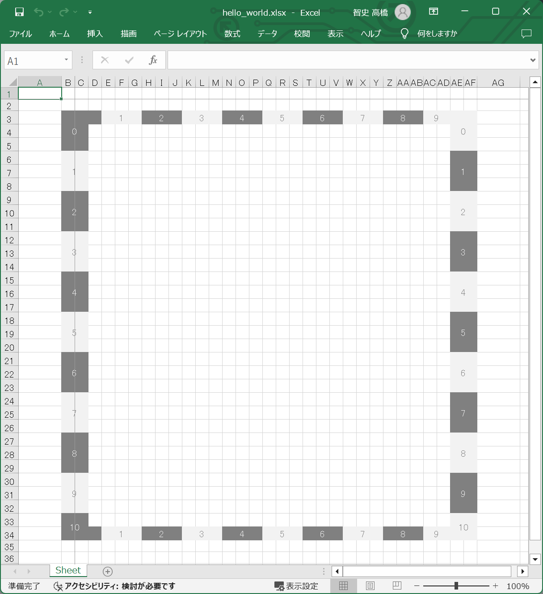

# プログラミング・レッスン１：　トレリスの座標

## 手順１

  

👆　Excel のワークシートの全ての列の幅を 30 pixels にします。  


## 手順２

  

👆　Excel のワークシートの全ての行の高さを 30 pixels にします。  


## 手順３

  

👆　ファイル名を `no1.xlsx` などにして保存してください。  

レッスンでは 📁 `temp` ディレクトリー下にファイルを置きます。  
レッスン中では、誤操作でファイルの削除や上書きなど、ファイルの破損が起こる可能性があります。  
**temp ディレクトリーの中のファイルは、操作ミスなどにより損失や破損をしても構わないという快諾を頂いた前提で話しを進めていきます。**  


## 手順４

以下のコマンドを打鍵してください。

```shell
py trellis.py init
```

そして、指示に従ってください。以下のファイルが作られます。  
📄 `./temp/lesson/hello_world.json`  

ファイルの内容は、例えば以下のようなものです。  

```json
{
    "canvas": {
        "left": 0,
        "top": 0,
        "width": 100,
        "height": 100
    },
    "ruler": {
        "visible": true
    }
}
```

👆　left と top は 0 にしておいてください


## 手順５

以下のコマンドを打鍵してください。

```shell
py trellis.py ruler --file ./temp/lesson/hello_world.json --output ./temp/lesson/hello_world.xlsx
```

📄 `./temp/lesson/hello_world.xlsx` ファイルが作成されています。確認してください（下図）  

  

👆　［定規］がレンダリング（描画）されました。  

  

👆　［定規］の全体図  


## 手順６

この手順では、定規の見方を説明していきます。  

  

👆　トレリスでは、長方形の位置とサイズの指定に、（エクセルのセル番号ではなく）、［トレリスの定規］の番号を使います。  

  

👆　また、width, height の代わりに、right, bottom を使っても構いません。  
width と height はそれぞれ独立しているので、 width だけ right を使うといったことも可能です。  
width と right が両方指定されている場合、right を優先して使います。 right を削除したとき width に残っている値を使うかどうかは未定義です。  

right は長方形の右側の外、 bottom は長方形の下側の外であることに違和感を持つかもしれません。  
これは数学では **半開区間** と呼ばれるもので、珍しいものではありません。  
情報系の人の間では半開区間は便利だと使いまくられているので、right は右側の外に出ているものとし、bottom は下側の外に出ているものとして使ってみてください。  

  

👆　トレリスの［定規］の番号では表せない　N列や　12行目を指定したいときには、上図のような書き方で指定できます。  

例： `3o2`  

トレリスの［定規］番号の後ろに、スペースを開けずに小文字の `o` を付け、その後ろにスペースを開けずに 1 または 2 を付けてください。  
例えば `3o2` （文字列）に、 `0o1` （文字列）を足すと 4 （整数）になります。  
`3o3` や `4o0` という書き方も認められますが、 4 と等しいです。  

アメリカの野球ではピッチャーが何回まで投げたかを表すのに　３回の２アウトを　`3.2`　と書いたりする 📖[投球回（Innings pitched）](https://ja.wikipedia.org/wiki/%E6%8A%95%E7%90%83%E5%9B%9E) という書き方があり、 3.2 + 0.1 の答えが 4 になります。  
これは野球ならではで、数学は好きに定義してよいというルールを上手く使った例ですが、  
それを［トレリスの定規］でもそのまま使おうとすると 3.2 に 0.1 を足したら 3.3 だろ、と誤解を与え（プログラマー自身もドツボにハマる）かねません。  
これを避けるため、小数点 `.` を、形に似ている小文字の `o` に変え、これは小数ではないよ、ということが分かるように分けました。深い意味はありません。  

この算術は野球で普通に使われていて珍しいものではないので、使ってみてください。  

上述の Innings pitched と Rectangle はクラスとして実装されています。以下のファイルから探してみてください。  

* 📄 [Trellis ＞ InningsPitched クラス](../../../src/trellis/__init__.py) - 正規表現 `class\s+InningsPitched` で検索してください  
* 📄 [Trellis ＞ Rectangle クラス](../../../src/trellis/__init__.py) - 正規表現 `class\s+Rectangle` で検索してください  


## 手順７

👇　手順４で作った 📄 `./temp/lesson/hello_world.json` ファイルの内容について、  

```json
{
    "canvas": {
        "left": "0o1",
        "top": "0o2",
        "width": "10o1",
        "height": "10o2"
    },
    "ruler": {
        "visible": true
    }
}
```

👆　left を `"0o1"`、 top を `"0o2"`、 width を `"10o1"`、 height を `"10o2"` に変更して保存してください。  

そして以下のコマンドを打鍵してください。  

```shell
py trellis.py ruler --file ./temp/lesson/hello_world.json --output ./temp/lesson/hello_world.xlsx
```

  

👆　［投球回］を使っても［定規］のサイズを指定できることを示せました。  

トレリスでは上１行、左２列をウィンドウ固定するので、 left と top は 0 にして使うことを推奨します。  

次回の記事は、色を指定するための、カラーシステムを予定しています。  
