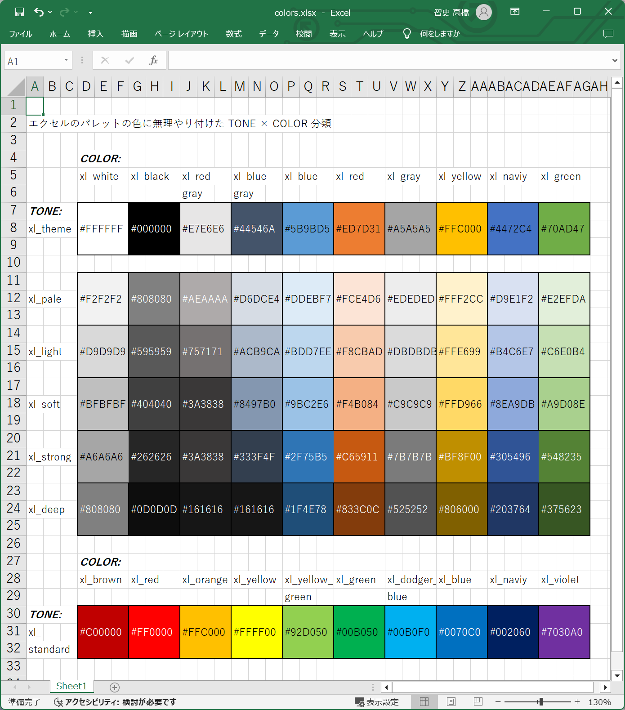
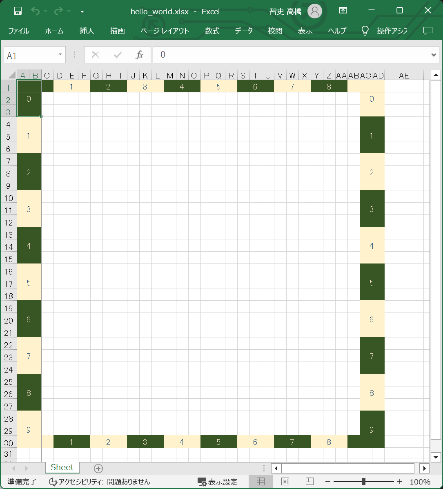
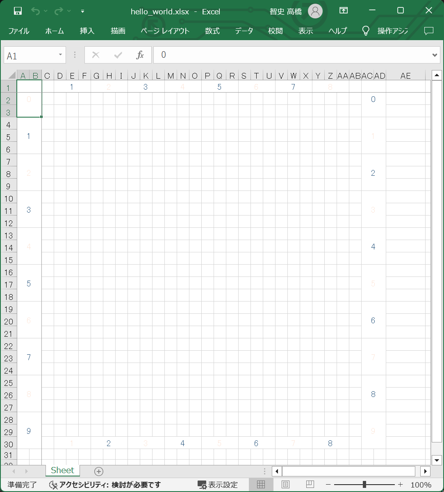
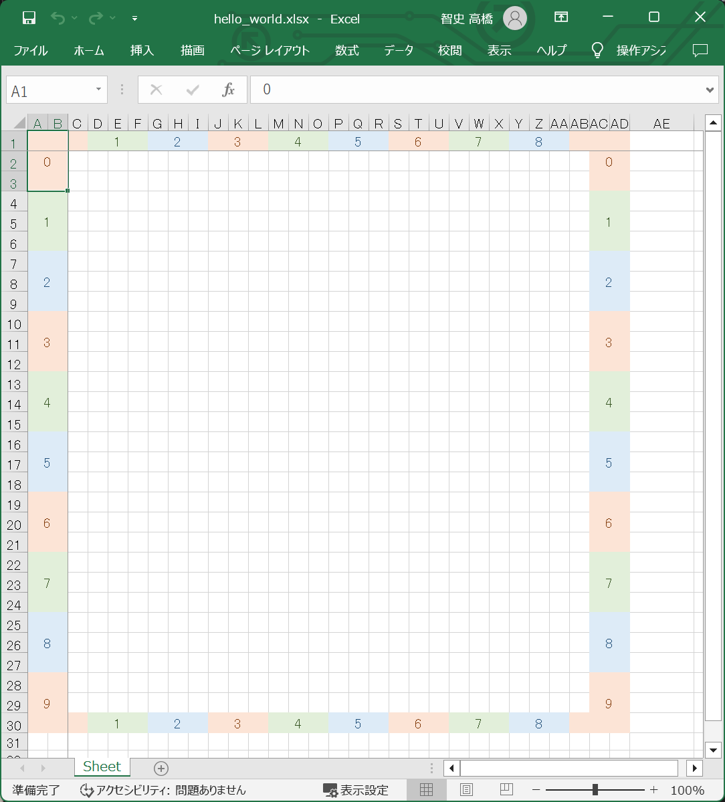

# プログラミング・レッスン２：　トレリスの色システム

## 手順１

  

👆　これは Microsoft Excel の色パレットを、 Windows Paint のスポイト機能を使って RGB値を調べ、  
わたしが勝手に色に名前を付けたものです。  

トーンと色の、２つの名前を使って１つの色を指定する仕組みです。  
トレリスでは、例えば上図 G列7行 にある黒色は `xl_theme.wl_white` と、スペースを開けずに詰めた名前で色を指定できるものとします。  


## 手順２

👇　［プログラミング・レッスン１の手順８］で作った 📄 `./temp/lesson/hello_world.json` ファイルの内容について、  

```json
{
    "canvas": {
        "left": 0,
        "top": 0,
        "width": 10,
        "height": 10
    },
    "ruler": {
        "visible": true,
        "fgColor": [
            "xl_pale.xl_red",
            "xl_deep.xl_blue"
        ],
        "bgColor": [
            "xl_deep.xl_green",
            "xl_pale.xl_yellow"
        ]
    }
}
```

👆　特に注意する点としては、 `["ruler"]["visible"]` の値を true に、  
`["ruler"]["fgColor"]` の値を `["xl_pale.xl_red", "xl_deep.xl_blue"]` に、  
`["ruler"]["bgColor"]` の値を `["xl_pale.xl_green", "xl_deep.xl_yellow"]` に変えてください。  

そして［プログラミング・レッスン１の手順８］と同様に、以下のコマンドを打鍵してください。  

```shell
py trellis.py compile --level 0 --file ./temp/lesson/hello_world.json --temp ./temp --output ./temp/lesson/hello_world.xlsx
```

  

👆　［定規］の色を変更しました。  


## 手順３

👇　📄 `./temp/lesson/hello_world.json` ファイルの内容について、  

```json
{
    "canvas": {
        "left": 0,
        "top": 0,
        "width": 10,
        "height": 10
    },
    "ruler": {
        "visible": true,
        "fgColor": [
            "xl_pale.xl_red",
            "xl_deep.xl_blue"
        ],
        "bgColor": [
            "paper_color",
            "paper_color"
        ]
    }
}
```

👆　`["ruler"]["bgColor"]` の値を `["paper_color", "paper_color"]` に変えてください。  

そして手順２と同様に、以下のコマンドを打鍵してください。  

```shell
py trellis.py compile --level 0 --file ./temp/lesson/hello_world.json --temp ./temp --output ./temp/lesson/hello_world.xlsx
```

  

👆　［定規］の背景色をワークシートの地の色に変更しました。（塗りつぶしを無しにしました）  
`paper_color` キーワードは `fgColor` には使えません。  


## 手順４

👇　📄 `./temp/lesson/hello_world.json` ファイルの内容について、  

```json
{
    "canvas": {
        "left": 0,
        "top": 0,
        "width": 10,
        "height": 10
    },
    "ruler": {
        "visible": true,
        "fgColor": [
            "xl_deep.xl_red",
            "xl_deep.xl_green",
            "xl_deep.xl_blue"
        ],
        "bgColor": [
            "xl_pale.xl_red",
            "xl_pale.xl_green",
            "xl_pale.xl_blue"
        ]
    }
}
```

👆　`["ruler"]["fgColor"]` と `["ruler"]["bgColor"]` の配列の要素を３つにしてください。  

そして手順３と同様に、以下のコマンドを打鍵してください。  

```shell
py trellis.py compile --level 0 --file ./temp/lesson/hello_world.json --temp ./temp --output ./temp/lesson/hello_world.xlsx
```

  

👆　［定規］の背景色を３色にしました。  


## 次回

次回の記事：　📖 [トレリスの矩形描画](../3/README.md)  
