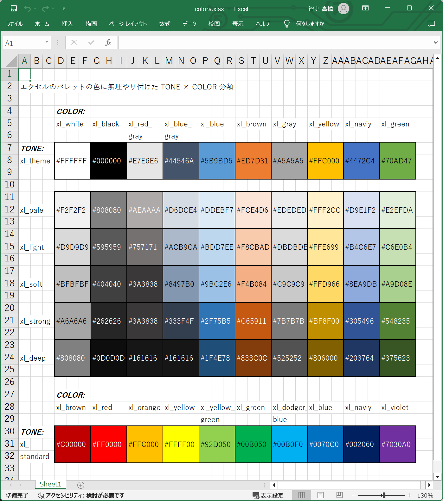

# プログラミング・レッスン１：　トレリスの色システム

## 手順１

  

👆　これは Microsoft Excel の色パレットを、 Windows Paint のスポイト機能を使って RGB値を調べ、  
わたしが勝手に色に名前を付けたものです。  

トーンと色の、２つの名前を使って１つの色を指定する仕組みです。  
トレリスでは、例えば上図 G列7行 にある黒色は `xl_theme.wl_white` と、スペースを開けずに詰めた名前で色を指定できるものとします。  

