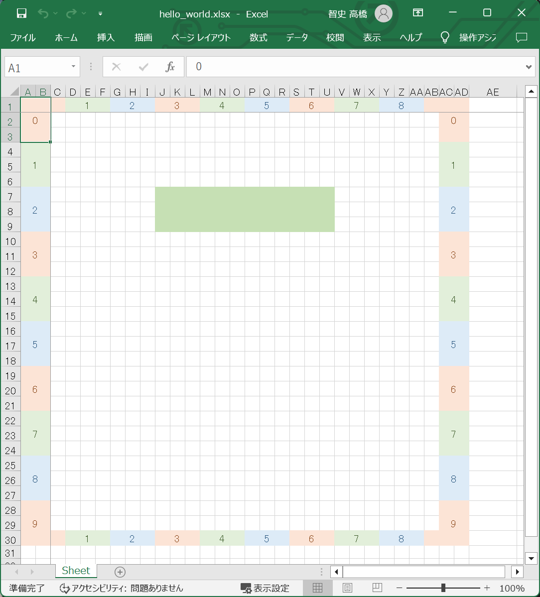
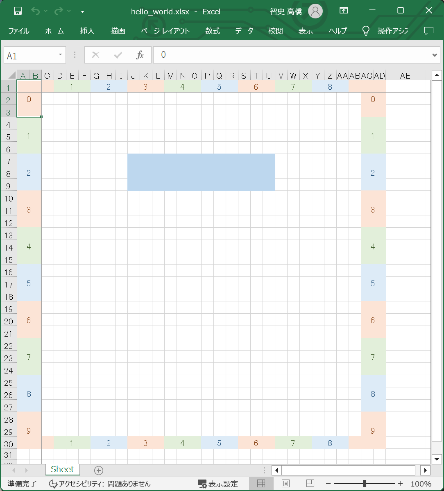
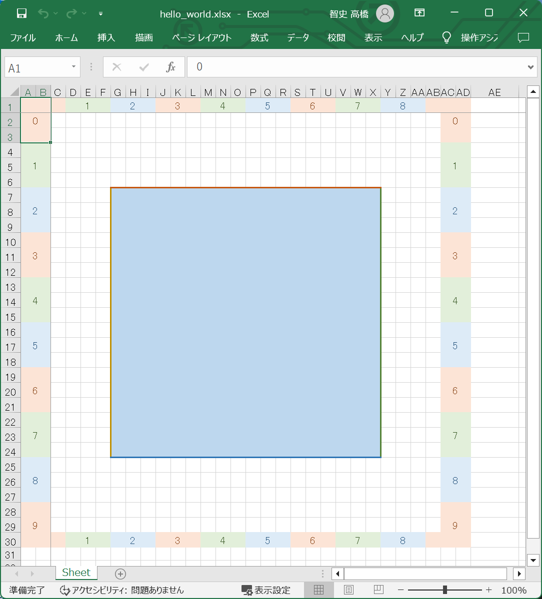

# プログラミング・レッスン３：　トレリスの矩形描画

## 手順１

👇　［プログラミング・レッスン２の手順４］で作った 📄 `./temp/lesson/hello_world.json` ファイルの内容について、  

```json
{
    "canvas": {
        "rect": {
            "left": 0,
            "top": 0,
            "width": 10,
            "height": 10
        }
    },
    "ruler": {
        "visible": true,
        "fgColor": [
            "xl_deep.xl_red",
            "xl_deep.xl_green",
            "xl_deep.xl_blue"
        ],
        "bgColor": [
            "xl_pale.xl_red",
            "xl_pale.xl_green",
            "xl_pale.xl_blue"
        ]
    },
    "rectangles": [
        {
            "left": 3,
            "top": 2,
            "width": 4,
            "height": 1,
            "bgColor": "xl_light.xl_green"
        }
    ]
}
```

👆　`"rectangles": [` の辺りのコードを書き足してください。  

そして、以下のコマンドを打鍵してください。  

```shell
py trellis.py compile --file ./temp/lesson/hello_world.json --temp ./temp --output ./temp/lesson/hello_world.xlsx
```

  

👆　［矩形］を描画できました。  


## 手順２

👇　引き続き 📄 `./temp/lesson/hello_world.json` ファイルの内容について、  

```json
{
    "canvas": {
        "rect": {
            "left": 0,
            "top": 0,
            "width": 10,
            "height": 10
        }
    },
    "ruler": {
        "visible": true,
        "fgColor": [
            "xl_deep.xl_red",
            "xl_deep.xl_green",
            "xl_deep.xl_blue"
        ],
        "bgColor": [
            "xl_pale.xl_red",
            "xl_pale.xl_green",
            "xl_pale.xl_blue"
        ]
    },
    "rectangles": [
        {
            "left": 3,
            "right": 7,
            "top": 2,
            "bottom": 3,
            "bgColor": "xl_light.xl_blue"
        }
    ]
}
```

👆　`["rectangles"]["width"]` に代えて `["rectangles"]["right"]` を、  
`["rectangles"]["height"]` に代えて `["rectangles"]["bottom"]` を使ってください。  

そして、以下のコマンドを打鍵してください。  

```shell
py trellis.py compile --file ./temp/lesson/hello_world.json --temp ./temp --output ./temp/lesson/hello_world.xlsx
```

  

👆　手順１と同じサイズの［矩形］を描画できました。  


## 手順３

👇　引き続き 📄 `./temp/lesson/hello_world.json` ファイルの内容について、  

```json
{
    "canvas": {
        "rect": {
            "left": 0,
            "top": 0,
            "width": 10,
            "height": 10
        }
    },
    "ruler": {
        "visible": true,
        "fgColor": [
            "xl_deep.xl_red",
            "xl_deep.xl_green",
            "xl_deep.xl_blue"
        ],
        "bgColor": [
            "xl_pale.xl_red",
            "xl_pale.xl_green",
            "xl_pale.xl_blue"
        ]
    },
    "rectangles": [
        {
            "left": 2,
            "top": 2,
            "width": 6,
            "height": 6,
            "bgColor": "xl_light.xl_blue",
            "xl_border": {
                "top": {
                    "color": "xl_strong.xl_red",
                    "xl_style": "thick"
                },
                "right": {
                    "color": "xl_strong.xl_green",
                    "xl_style": "thick"
                },
                "bottom": {
                    "color": "xl_strong.xl_blue",
                    "xl_style": "thick"
                },
                "left": {
                    "color": "xl_strong.xl_yellow",
                    "xl_style": "thick"
                }
            }
        }
    ]
}
```

👆　`["rectangles"]["xl_border"]` 辞書を追加しました。  
ここで `["rectangles"]["xl_border"]["top"]["xl_style"]` には、 `mediumDashed`, `mediumDashDotDot`, `dashDot`, `dashed`, `slantDashDot`, `dashDotDot`, `thick`, `thin`, `dotted`, `double`, `medium`, `hair`, `mediumDashDot` のいずれかを入れることができると思います。  

  

👆　境界線を引けました。 Microsoft Excel をディスプレイと考えているケースでだけ使えることを想定しています。  

これで点描は打てそうです。  


## 次回

次回の記事：　📖 [トレリスのテキスト表示](../4/README.md)  
