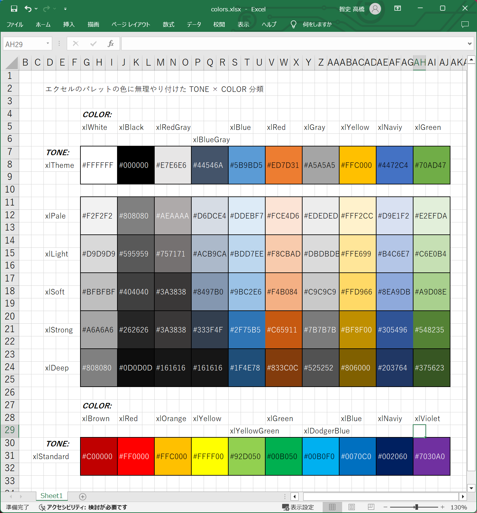
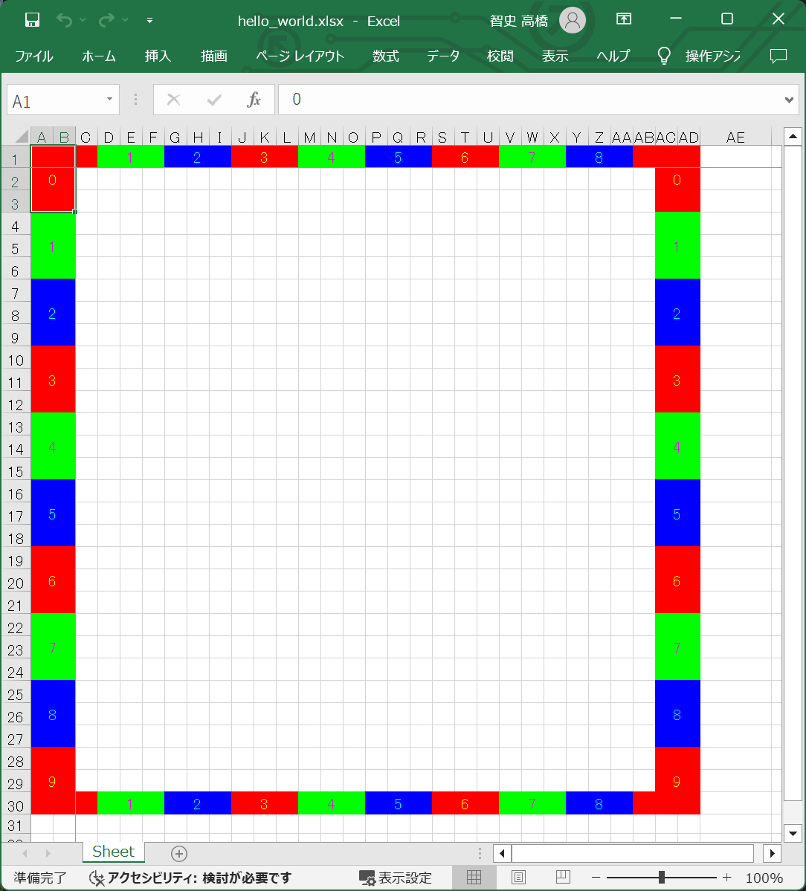

# プログラミング・レッスン２：　トレリスの色システム

## 手順１

  

👆　これは Microsoft Excel の色パレットを、 Windows Paint のスポイト機能を使って RGB値を調べ、  
わたしが勝手に色に名前を付けたものです。  

トーンと色の、２つの名前を使って１つの色を指定する仕組みです。  
トレリスでは、例えば上図 G列7行 にある黒色は `xlTheme.wl_white` と、スペースを開けずに詰めた名前で色を指定できるものとします。  


## 手順２

👇　［プログラミング・レッスン１の手順８］で作った 📄 `./temp/lesson/hello_world.json` ファイルの内容について、  

```json
{
    "imports": [
        "./examples/data_of_contents/alias_for_color.json"
    ],
    "canvas": {
        "varBounds": {
            "left": 0,
            "top": 0,
            "width": 10,
            "height": 10
        }
    },
    "ruler": {
        "visible": true,
        "foreground": {
            "varColors": [
                "xlPale.xlRed",
                "xlDeep.xlBlue"
            ]
        },
        "background": {
            "varColors": [
                "xlDeep.xlGreen",
                "xlPale.xlYellow"
            ]
        }
    }
}
```

👆　特に注意する点としては、 `["ruler"]["visible"]` の値を true に、  
`["ruler"]["foreground"]["varColors"]` の値を `["xlPale.xlRed", "xlDeep.xlBlue"]` に、  
`["ruler"]["background"]["varColors"]` の値を `["xlPale.xlGreen", "xlDeep.xlYellow"]` に変えてください。  

そして［プログラミング・レッスン１の手順８］と同様に、以下のコマンドを打鍵してください。  

```shell
py trellis.py build --config ./trellis_config.json --source ./temp/lesson/hello_world.json --temp ./temp --output ./temp/lesson/hello_world.xlsx
```

  

👆　［定規］の色を変更しました。  


## 手順３

👇　📄 `./temp/lesson/hello_world.json` ファイルの内容について、  

```json
{
    "imports": [
        "./examples/data_of_contents/alias_for_color.json"
    ],
    "canvas": {
        "varBounds": {
            "left": 0,
            "top": 0,
            "width": 10,
            "height": 10
        }
    },
    "ruler": {
        "visible": true,
        "foreground": {
            "varColors": [
                "xlPale.xlRed",
                "xlDeep.xlBlue"
            ]
        },
        "background": {
            "varColors": [
                "paperColor",
                "paperColor"
            ]
        }
    }
}
```

👆　`["ruler"]["background"]["varColor"]` の値を `["paperColor", "paperColor"]` に変えてください。  

そして手順２と同様に、以下のコマンドを打鍵してください。  

```shell
py trellis.py build --config ./trellis_config.json --source ./temp/lesson/hello_world.json --temp ./temp --output ./temp/lesson/hello_world.xlsx
```

  

👆　［定規］の背景色をワークシートの地の色に変更しました。（塗りつぶしを無しにしました）  
`paperColor` キーワードは `["foreground"]["varColors"]` には使えません。  


## 手順４

👇　📄 `./temp/lesson/hello_world.json` ファイルの内容について、  

```json
{
    "imports": [
        "./examples/data_of_contents/alias_for_color.json"
    ],
    "canvas": {
        "varBounds": {
            "left": 0,
            "top": 0,
            "width": 10,
            "height": 10
        }
    },
    "ruler": {
        "visible": true,
        "foreground": {
            "varColors": [
                "xlDeep.xlRed",
                "xlDeep.xlGreen",
                "xlDeep.xlBlue"
            ]
        },
        "background": {
            "varColors": [
                "xlPale.xlRed",
                "xlPale.xlGreen",
                "xlPale.xlBlue"
            ]
        }
    }
}
```

👆　`["ruler"]["foreground"]["varColors"]` と `["ruler"]["background"]["varColors"]` の配列の要素を３つにしてください。  

そして手順３と同様に、以下のコマンドを打鍵してください。  

```shell
py trellis.py build --config ./trellis_config.json --source ./temp/lesson/hello_world.json --temp ./temp --output ./temp/lesson/hello_world.xlsx
```

  

👆　［定規］の背景色を３色にしました。  


## 手順５

👇　📄 `./temp/lesson/hello_world.json` ファイルの内容について、  

```json
{
    "imports": [
        "./examples/data_of_contents/alias_for_color.json"
    ],
    "canvas": {
        "varBounds": {
            "left": 0,
            "top": 0,
            "width": 10,
            "height": 10
        }
    },
    "ruler": {
        "visible": true,
        "foreground": {
            "varColors": [
                "#FFFF00",
                "#FF00FF",
                "#00FFFF"
            ]
        },
        "background": {
            "varColors": [
                "#FF0000",
                "#00FF00",
                "#0000FF"
            ]
        }
    }
}
```

👆　`["ruler"]["foreground"]["varColors"]` と `["ruler"]["background"]["varColors"]` の配列の要素を変更してください。  

そして手順３と同様に、以下のコマンドを打鍵してください。  

```shell
py trellis.py build --config ./trellis_config.json --source ./temp/lesson/hello_world.json --temp ./temp --output ./temp/lesson/hello_world.xlsx
```

  

👆　ウェブ・セーフ・カラーを使った色指定もできました。  


## 次回

次回の記事：　📖 [トレリスの矩形描画](../3/README.md)  
