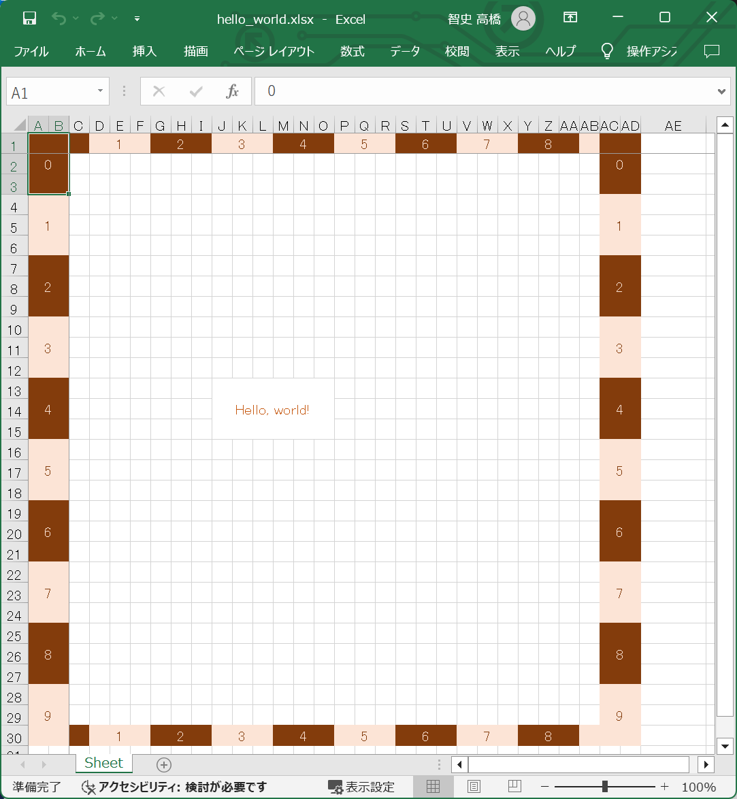

# プログラミング・レッスン４：　トレリスのテキスト表示

## 手順１

👇　以下の内容の 📄 `./temp/lesson/hello_world.json` ファイルを作ってください。  

```json
{
    "imports": [
        "./examples/data_of_contents/alias_for_color.json"
    ],
    "canvas": {
        "bounds": {
            "left": 0,
            "top": 0,
            "width": 10,
            "height": 10
        }
    },
    "ruler": {
        "visible": true,
        "foreground": {
            "varColors": [
                "xlPale.xlRed",
                "xlDeep.xlRed"
            ]
        },
        "background": {
            "varColors": [
                "xlDeep.xlRed",
                "xlPale.xlRed"
            ]
        }
    },
    "rectangles" : [
        {
            "bounds" : {
                "left": 3,
                "top": 4,
                "width": 2,
                "height": 1
            },
            "color": "paperColor",
            "mergeCells": true
        }
    ],
    "xlTexts": [
        {
            "location": {
                "x": 3,
                "y": 4
            },
            "text": "Hello, world!",
            "xlAlignment" : {
                "xlHorizontal" : "center",
                "xlVertical" : "center"
            },
            "xlFont": {
                "color": "xlStrong.xlRed"
            }
        }
    ]
}
```

👆　`["xlTexts"]` の辺りを説明していきます。  
色は趣味で設定してください。  

そして、以下のコマンドを打鍵してください。  

```shell
py trellis.py build --config ./trellis_config.json --source ./temp/lesson/hello_world.json --temp ./temp --output ./temp/lesson/hello_world.xlsx
```

  

👆　テキストを描画できた。  

* `xlHorizontal` には `fill`, `left`, `distributed`, `justify`, `center`, `general`, `centerContinuous`, `right` が入れられるはず。  
* `xlVertical` には `distributed`, `justify`, `center`, `bottom`, `top` が入れられるはず。  


## 次回

次回は［トレリスでの影表示］を予定しています。  
