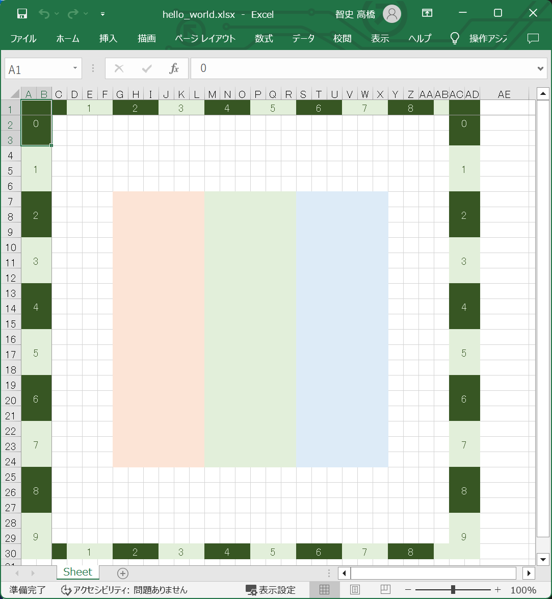
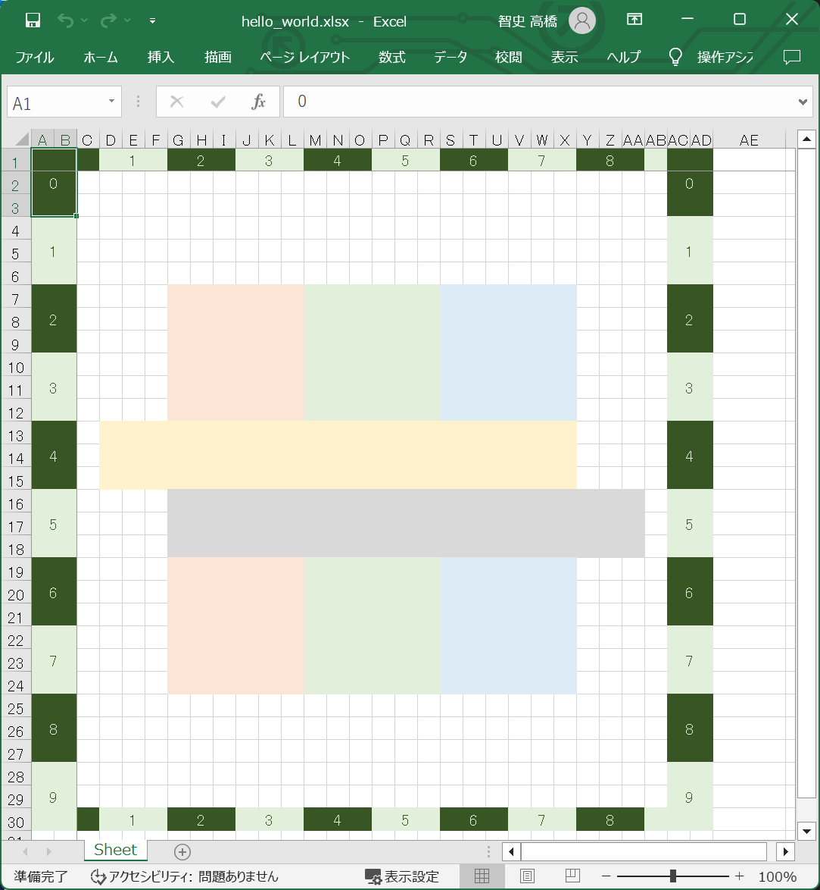

# プログラミング・レッスン５：　トレリスの影描画

## 手順１

👇　以下の内容の 📄 `./temp/lesson/hello_world.json` ファイルを作ってください。  

```json
{
    "canvas": {
        "bounds": {
            "left": 0,
            "top": 0,
            "width": 10,
            "height": 10
        }
    },
    "ruler": {
        "visible": true,
        "fgColor": [
            "xlPale.xlGreen",
            "xlDeep.xlGreen"
        ],
        "bgColor": [
            "xlDeep.xlGreen",
            "xlPale.xlGreen"
        ]
    },
    "rectangles" : [
        {
            "bounds" : {
                "left": 2,
                "right": 4,
                "top": 2,
                "bottom": 8
            },
            "color": "xlPale.xlRed"
        },
        {
            "bounds" : {
                "left": 4,
                "right": 6,
                "top": 2,
                "bottom": 8
            },
            "color": "xlPale.xlGreen"
        },
        {
            "bounds" : {
                "left": 6,
                "right": 8,
                "top": 2,
                "bottom": 8
            },
            "color": "xlPale.xlBlue"
        }
    ]
}
```

そして、以下のコマンドを打鍵してください。  

```shell
py trellis.py build --config ./trellis_config.json --source ./temp/lesson/hello_world.json --temp ./temp --output ./temp/lesson/hello_world.xlsx
```

  

👆　ひとまず、これを地面とします。  


## 手順２

👇　以下の内容の 📄 `./temp/lesson/hello_world.json` ファイルを作ってください。  

```json
{
    "canvas": {
        "bounds": {
            "left": 0,
            "top": 0,
            "width": 10,
            "height": 10
        }
    },
    "ruler": {
        "visible": true,
        "fgColor": [
            "xlPale.xlGreen",
            "xlDeep.xlGreen"
        ],
        "bgColor": [
            "xlDeep.xlGreen",
            "xlPale.xlGreen"
        ]
    },
    "rectangles" : [
        {
            "bounds" : {
                "left": 2,
                "right": 4,
                "top": 2,
                "bottom": 8
            },
            "color": "xlPale.xlRed"
        },
        {
            "bounds" : {
                "left": 4,
                "right": 6,
                "top": 2,
                "bottom": 8
            },
            "color": "xlPale.xlGreen"
        },
        {
            "bounds" : {
                "left": 6,
                "right": 8,
                "top": 2,
                "bottom": 8
            },
            "color": "xlPale.xlBlue"
        },
        {
            "bounds" : {
                "left": 1,
                "right": 8,
                "top": 4,
                "bottom": 5
            },
            "color": "xlPale.xlYellow"
        },
        {
            "bounds" : {
                "left": 2,
                "right": 9,
                "top": 5,
                "bottom": 6
            },
            "color": "xlLight.xlWhite"
        }
    ]
}
```

👆　rectangles に要素を２つ追加しました。  

そして、以下のコマンドを打鍵してください。  

```shell
py trellis.py build --config ./trellis_config.json --source ./temp/lesson/hello_world.json --temp ./temp --output ./temp/lesson/hello_world.xlsx
```

  

👆　横長の長方形を黄色で塗りつぶし、その右下に横長の長方形をグレーで塗りつぶしました。  
トレリスではこれをドロップシャドウと呼びます。  


## 手順３

👇　以下の内容の 📄 `./temp/lesson/hello_world.json` ファイルを作ってください。  

```json
{
    "canvas": {
        "bounds": {
            "left": 0,
            "top": 0,
            "width": 10,
            "height": 10
        }
    },
    "ruler": {
        "visible": true,
        "fgColor": [
            "xlPale.xlGreen",
            "xlDeep.xlGreen"
        ],
        "bgColor": [
            "xlDeep.xlGreen",
            "xlPale.xlGreen"
        ]
    },
    "colorSystem": {
        "darkness": {
            "paperColor": "xlPale.xlWhite",
            "xlPale.xlRed": "xlLight.xlRed",
            "xlPale.xlGreen": "xlLight.xlGreen",
            "xlPale.xlBlue": "xlLight.xlBlue"
        }
    },
    "rectangles" : [
        {
            "bounds" : {
                "left": 2,
                "right": 4,
                "top": 2,
                "bottom": 8
            },
            "color": "xlPale.xlRed"
        },
        {
            "bounds" : {
                "left": 4,
                "right": 6,
                "top": 2,
                "bottom": 8
            },
            "color": "xlPale.xlGreen"
        },
        {
            "bounds" : {
                "left": 6,
                "right": 8,
                "top": 2,
                "bottom": 8
            },
            "color": "xlPale.xlBlue"
        },
        {
            "bounds" : {
                "left": 1,
                "right": 8,
                "top": 4,
                "bottom": 5
            },
            "color": "xlPale.xlYellow"
        },
        {
            "bounds" : {
                "left": 2,
                "right": 9,
                "top": 5,
                "bottom": 6
            },
            "colorFunc": {
                "darkness": 1
            }
        }
    ]
}
```

👆　rectangles に要素を２つ追加しました。  

そして、以下のコマンドを打鍵してください。  

```shell
py trellis.py build --config ./trellis_config.json --source ./temp/lesson/hello_world.json --temp ./temp --output ./temp/lesson/hello_world.xlsx
```
